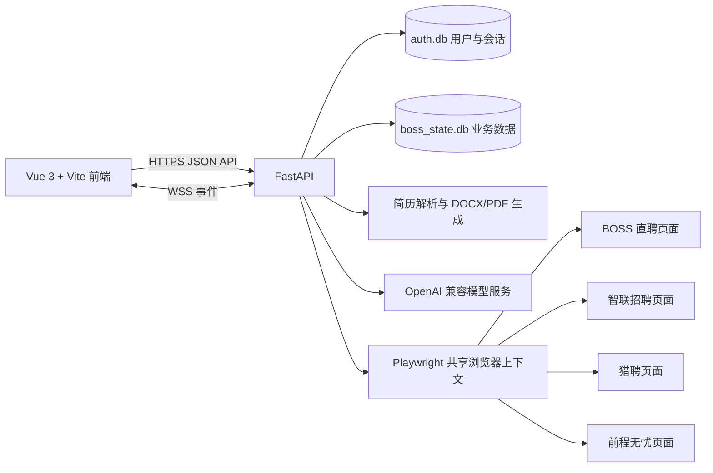

<div align="center">

# MyJob

### 面向个人求职者的自动化求职工作台

从岗位与城市筛选开始，把简历定制、投递、HR 沟通和面试意向集中到一套可持续推进的工作流中。

[](CHANGELOG.md)
[](resume_ui)
[](boss_app.py)
[](pyproject.toml)
[](LICENSE)

[快速开始](#快速开始) · [产品能力](#产品能力) · [简历中心](#简历中心) · [账户与管理后台](#账户与管理后台) · [技术架构](#技术架构) · [部署](#生产部署)

</div>

## 项目定位

MyJob 是一个本地优先、支持轻量服务器部署的求职管理应用。普通用户先注册并登录 MyJob，再在独立的 Playwright 浏览器中登录招聘平台。应用账号与招聘平台账号完全分离，避免把两种登录状态混在一起。

当前平台接入状态：

| 招聘平台 | 状态 | 当前能力 |
| --- | --- | --- |
| BOSS 直聘 | 已接入 | 浏览器登录、岗位搜索、筛选、投递、会话同步与沟通辅助 |
| 智联招聘 | 已接入 | 浏览器登录、岗位搜索、筛选、岗位入库与单岗位投递 |
| 前程无忧 | 已接入 | 浏览器登录、岗位搜索、筛选、岗位入库与单岗位投递 |
| 猎聘 | 已接入 | 浏览器登录、岗位搜索、筛选、岗位入库与单岗位沟通或投递 |

四个平台复用一个 Playwright BrowserContext，每个平台使用独立页面。Cookie 按平台域名隔离，登出一个平台不会清除其他平台会话。BOSS 直聘继续承担消息同步和招聘者活跃度筛选，三个新平台暂不提供持续消息同步。

MyJob 只用于个人账号的求职辅助。自动化操作必须遵守招聘平台规则，遇到验证码、访问限制或风险提示时应立即停止并转为人工操作。

## 产品能力

### 岗位与城市筛选

- 在四个平台按关键词、目标城市、薪资、经验和学历筛选岗位。
- 公司规模、融资阶段、福利条件和招聘者活跃度等深度筛选当前以 BOSS 直聘为主。
- 保存岗位、公司、区域、HR 活跃度与处理状态，减少重复浏览和重复投递。
- 支持公司去重、不活跃 HR 过滤、每日投递上限和批量操作冷却。
- 岗位分析可结合 JD、主简历与公司信息输出匹配结论、风险点和建议问题。

### 求职计划

- 以岗位关键词和城市组合创建持续求职计划。
- 计划可以搜索岗位、进行本地匹配、生成 JD 定制简历并跟踪执行状态。
- 默认保留人工确认环节；只有显式开启并再次确认后才允许自动投递。
- 调度任务只在服务运行且 BOSS 浏览器已登录时执行。

### HR 沟通与面试意向

- 在沟通中心查看会话、消息记录、未读状态与微信交换记录。
- 用户主动点击同步时才访问招聘平台，普通浏览优先读取本地缓存。
- 支持固定招呼语、AI 沟通建议和可选的 AI 自动回复。
- 将高意向会话集中展示，但不会代替用户承诺具体面试时间。

### 工作台

登录后的悬浮式工作台包含：

- 工作台概览：待处理岗位、今日投递、待回复和面试意向。
- 岗位中心：搜索、筛选、分析、收藏、跳过和投递。
- 简历中心：结构化编辑、模板选择、实时预览和导出。
- 求职计划：创建、运行、暂停和查看计划执行结果。
- 沟通中心：会话同步、消息发送、暂停与恢复自动回复。
- 设置与安全：AI 配置、求职偏好、自动化边界、运行诊断和密码修改。

公开首页、产品文档与更新日志无需登录；所有业务页面、业务 API 和 WebSocket 都需要有效的 MyJob 会话。

## 简历中心

### 结构化编辑器

Vue 简历编辑器支持以下模块：

- 个人资料
- 个人简介
- 工作经历
- 教育经历
- 项目经历
- 专业技能
- 自我评价

每个模块都可以启用、隐藏、拖拽排序或使用上下按钮调整位置。工作经历、教育经历和项目经历支持多条记录及条目拖拽；经历日期使用年月选择器，并阻止结束时间早于开始时间。工作和项目描述支持有序或无序分点。

个人资料支持上传 JPG、PNG 或 WebP 职业照片。除手机、邮箱、所在城市、个人主页、微信和年龄外，各文本字段都可以单独调整字号与行距；字体、主题色、页边距和模块间距按整份简历统一设置。

### 模板与导出

- 内置 18 套模板，覆盖 ATS 单栏、现代横幅、技术、产品、运营、数据、学术、校招、双栏、侧栏和管理岗位等场景。
- 模板库支持名称搜索、场景筛选与仅查看 ATS 友好模板。
- 切换模板只改变视觉和布局，不改写用户的简历事实。
- 支持实时 A4 预览，并按当前模板导出 DOCX、PDF、HTML 或 Markdown。

### 导入与 JD 定制

主简历支持上传并解析 DOCX、PDF、TXT、Markdown、HTML、RTF、JSON 和 ODT。解析完成后会转换为统一结构，再匹配用户选择的模板。

JD 定制稿以主简历为唯一事实来源。系统会根据岗位描述调整表达和重点，不应新增主简历中不存在的经历、技能或数据。生成结果需要用户核实后再用于投递。

## 账户与管理后台

### 普通用户

- 用户名必须为 8 至 12 位英文和数字组合，且必须同时包含字母与数字。
- 密码必须包含英文大写、英文小写、数字和特殊字符，长度为 8 至 128 位。
- 密码使用 PBKDF2-SHA256 加盐哈希，服务端不保存明文密码。
- 登录状态使用签名会话和 `HttpOnly`、`SameSite=Lax` Cookie。
- 修改密码、退出工作台或停用账号后，旧会话立即失效。

### 管理员后台

管理员入口与普通用户入口分离：

```text
https://127.0.0.1:8010/MyJobaAdmin
```

新安装会创建默认超级管理员：

```text
账号：Admin
密码：123456*
```

首次登录必须修改默认密码。生产环境建议在首次启动前通过 `MYJOB_SUPERADMIN_USERNAME` 和 `MYJOB_SUPERADMIN_PASSWORD` 设置独立凭据。

管理后台提供：

- 注册用户数、当前在线、今日活跃、累计在线时长与累计登录次数。
- 最近 7 日注册、活跃与在线时长趋势。
- 普通用户注册开关、账号启用与停用。
- 超级管理员创建和管理管理员账号。
- 最近登录、在线状态、登录次数和累计在线时长查看。

IP 与 User-Agent 只保存不可逆短哈希，不保存原文。

## 技术架构



| 层级 | 技术与职责 |
| --- | --- |
| 前端 | Vue 3、Vite、Iconify、vuedraggable、响应式日间与夜间主题 |
| 后端 | Python 3.10+、FastAPI、Uvicorn、REST API、WebSocket |
| 数据 | SQLite WAL，认证数据与业务数据分库保存 |
| 自动化 | Playwright 可见浏览器、共享上下文、独立平台页面与持久化登录状态 |
| 简历 | python-docx、ReportLab、pdfplumber、pypdf |
| 安全 | PBKDF2-SHA256、签名会话、登录限流、HTTPS |
| AI | DeepSeek、OpenRouter、小米 MiMo 或其他 OpenAI 兼容接口 |

前端工程位于 `resume_ui/`，生产构建输出到 `static/app/`。FastAPI 在生产环境中同时托管静态资源和 API，保持同源并减少轻量部署所需的组件数量。

为了降低服务器与数据库压力：

- 概览使用前后端短缓存和单个聚合接口。
- 页面隐藏时停止兜底轮询，主要依赖 WebSocket 事件刷新。
- 在线心跳每 60 秒发送，服务端约 50 秒才落库一次。
- 岗位列表默认分页，统计使用 SQL 聚合而不是读取完整记录。
- 简历编辑器与业务页面在登录后动态加载。

更完整的职责划分见 [前后端分离与轻量部署说明](docs/frontend-backend-architecture.md)。

## 快速开始

### 环境要求

- Python 3.10 或更高版本
- Node.js 20.19+ 或 22.12+
- Windows、macOS 或 Linux

### 1. 获取项目

```bash
git clone https://github.com/golddog9598-cmyk/MyJob.git
cd MyJob
git checkout MyJob
```

### 2. 安装后端

```bash
python -m venv .venv

# Windows PowerShell
.venv\Scripts\Activate.ps1

# macOS / Linux
source .venv/bin/activate

python -m pip install -e .
python -m playwright install firefox
```

### 3. 构建前端

```bash
cd resume_ui
npm ci
npm run build
cd ..
```

### 4. 启动 HTTPS 服务

```bash
python boss_app.py --host 127.0.0.1 --port 8010
```

Windows 也可以直接运行：

```text
start.bat
```

启动后访问：

| 页面 | 地址 |
| --- | --- |
| 产品首页 | `https://127.0.0.1:8010/` |
| 登录与注册 | `https://127.0.0.1:8010/login` |
| 用户工作台 | `https://127.0.0.1:8010/app` |
| 产品文档 | `https://127.0.0.1:8010/docs` |
| 更新日志 | `https://127.0.0.1:8010/changelog` |
| 管理员后台 | `https://127.0.0.1:8010/MyJobaAdmin` |

本地首次启动会在 `.boss_profile/tls/` 生成自签名证书，浏览器可能显示一次安全提醒。公网部署必须使用可信 HTTPS 证书。

### 5. 开始使用

1. 注册并登录 MyJob 普通用户账号。
2. 在顶部四个平台状态卡中选择目标平台，点击“启动登录”。
3. 在独立浏览器窗口中完成该平台登录，工作台会通过轻量心跳自动更新登录状态。
4. 已登录平台会高亮并显示绿色状态点，未登录平台保持灰色。
5. 设置目标城市、关键词、自动化边界和主简历。
6. 在岗位中心搜索并筛选，在简历中心确认定制稿后再投递。

## 开发

### 前端开发服务

先启动 HTTPS 后端，再运行：

```bash
cd resume_ui
npm install
npm run dev
```

Vite 会把 `/api` 和 `/ws` 代理到 `https://127.0.0.1:8010`。

### 构建与测试

```bash
cd resume_ui
npm run build
cd ..

python -m pytest tests --ignore=tests/test_smart_send.py -q
python -m py_compile boss_app.py MyJob_cli/cli.py
```

### CLI

安装后可使用 `myjob` 命令调用与 Web 工作台相同的后端能力：

```bash
myjob version
myjob doctor
myjob status
myjob search "AI Agent" --city 深圳 --platform zhilian
myjob jobs --platform liepin
myjob apply "<job-url>" --platform job51
myjob resume templates
myjob resume export --format pdf --output ./resume.pdf
myjob campaign list
```

运行 `myjob --help`、`myjob resume --help` 或 `myjob campaign --help` 查看完整命令。

## 配置

复制 `.env.example` 为 `.env`，或在系统环境变量中配置：

| 环境变量 | 用途 |
| --- | --- |
| `MYJOB_TLS_CERT` | HTTPS 证书路径，留空时生成本地自签名证书 |
| `MYJOB_TLS_KEY` | HTTPS 私钥路径 |
| `MYJOB_SECURE_COOKIE` | 是否强制使用 Secure Cookie |
| `MYJOB_CORS_ORIGINS` | 允许的前端来源列表 |
| `MYJOB_SESSION_HOURS` | MyJob 登录会话有效时长 |
| `MYJOB_SUPERADMIN_USERNAME` | 首次初始化时的超级管理员账号 |
| `MYJOB_SUPERADMIN_PASSWORD` | 首次初始化时的超级管理员密码 |

AI Key 在设置页提交给后端保存，读取设置时只返回“是否已配置”，不会把明文返回给前端。不要把 `.env`、`.boss_profile/`、数据库、浏览器状态或真实简历提交到 Git。

## 生产部署

轻量服务器建议保持单进程运行：

```bash
cd resume_ui
npm ci
npm run build
cd ..

python boss_app.py \
  --host 127.0.0.1 \
  --port 8010 \
  --ssl-certfile /path/fullchain.pem \
  --ssl-keyfile /path/privkey.pem
```

也可以由 Caddy 或 Nginx 终止公网 HTTPS，再反向代理到显式使用 `--http` 的本机服务。公网入口仍必须为 HTTPS，并设置 `MYJOB_SECURE_COOKIE=true`。

不要启动多个 Uvicorn worker。多个进程会分别持有浏览器实例、调度器与内存缓存，可能造成重复任务和登录状态冲突。

轻量服务器适合托管 Vue、FastAPI、认证和 SQLite。招聘平台自动化依赖可见浏览器、人工登录和安全验证，建议运行在用户本机或带桌面会话的受控主机，不建议放到无人值守的纯服务器环境。

## 项目结构

```text
MyJob/
├─ resume_ui/                 Vue 3 前端源码
│  └─ src/
│     ├─ views/               首页、工作台与管理员页面
│     └─ components/          登录、主题和简历编辑组件
├─ static/app/                Vue 生产构建产物
├─ boss_app.py                FastAPI、认证、API、WebSocket 与调度入口
├─ app_auth.py                用户、管理员、会话与在线统计
├─ boss_automation.py         BOSS 自动化业务流程
├─ boss_firefox.py            Playwright Firefox 页面控制
├─ job_platforms.py           四平台统一适配、登录隔离、搜索与投递
├─ boss_state.py              求职业务 SQLite 数据层
├─ resume_documents.py        简历解析、模板与文件导出
├─ resume_tailor.py           JD 定制简历逻辑
├─ job_campaign.py            求职计划与调度
├─ MyJob_cli/                 命令行客户端
├─ docs/                      架构与产品说明
└─ tests/                     后端与关键流程回归测试
```

## 路线图

- 继续提高智联招聘、前程无忧和猎聘页面变化下的兼容性。
- 完善三个新平台的消息同步、投递结果确认与更多筛选项。
- 扩展简历模板、模板预览和导出一致性。
- 完善面试邀约记录、提醒与数据看板。
- 为轻量服务器部署补充容器化和自动备份方案。

## 许可证

本项目使用 [MIT License](LICENSE)。
