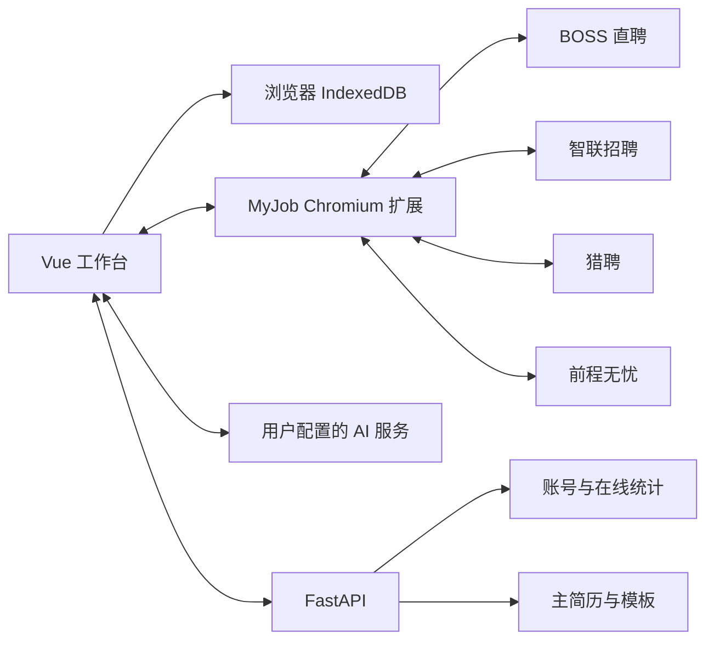

# MyJob

MyJob 是一个前后端分离的求职工作台，用于管理招聘平台登录、岗位与城市筛选、简历、投递、沟通和面试进度。

[](CHANGELOG.md)
[](resume_ui)
[](myjob_server.py)

## 数据边界

MyJob 从 V0.0.9 起执行固定的数据边界：

- 招聘平台登录检测、搜索、投递、消息同步和窗口控制全部在用户浏览器扩展中执行。
- 岗位、投递、会话、微信记录、求职计划和平台统计全部保存在浏览器 IndexedDB。
- FastAPI 后端只处理 MyJob 账号、管理员统计、主简历、简历模板和 Vue 静态文件。
- 招聘平台 Cookie、页面内容和业务数据不会发送到 MyJob 后端，也不会写入服务器数据库。
- 验证码、滑块、安全验证和平台风控必须由用户人工处理。

普通网页受浏览器同源策略限制，无法直接读取其他网站登录态。MyJob 使用本地 Chromium 扩展作为用户侧平台桥接层，Chrome 与 Microsoft Edge 可使用同一套扩展。

## 当前接入平台

- BOSS 直聘
- 智联招聘
- 猎聘
- 前程无忧

四个平台能力会继续逐步完善。页面结构变化时，只需更新浏览器扩展内对应站点适配器，不需要改动后端。

## 主要功能

- MyJob 普通用户注册、登录和会话保护。
- 独立管理员入口 `/MyJobaAdmin`。
- 顶部四平台登录状态卡和 15 秒用户侧心跳。
- 已登录平台高亮，未登录平台置灰。
- 已登录平台再次点击“启动登录”时不会打开重复窗口。
- “全部登出”清除四个平台用户侧登录状态。
- “停止”关闭所有招聘平台窗口。
- 工作台上方显示全平台汇总，下方按平台显示明细。
- 岗位、投递、计划和沟通数据按平台缓存在 IndexedDB。
- 四个平台分别执行每日投递上限，每个平台最大 50。
- 根据完整 JD 优化五个简历模块，提供四档事实约束和新增内容人工确认。
- 可编辑简历、模板切换、DOCX/PDF 导出和多格式导入。

## 架构



FastAPI 不连接招聘平台，平台页面数据只在 `UI -> IndexedDB` 与 `UI <-> 扩展 <-> 招聘平台` 两条用户侧链路内流动。JD 优化由浏览器直连用户配置的 AI 服务，不经过 MyJob 后端。

## 技术栈

| 层 | 技术 |
|---|---|
| Web 前端 | Vue 3、Vite、CSS Variables、IndexedDB |
| 平台桥接 | Chromium Manifest V3、Content Scripts、Service Worker |
| 账号与简历后端 | Python 3.10+、FastAPI、Uvicorn、SQLite |
| 简历处理 | python-docx、ReportLab、pdfplumber、BeautifulSoup |
| 传输 | HTTPS、HttpOnly Cookie |

## 安装

### Python

```powershell
python -m pip install -r requirements.txt
```

### Vue

```powershell
cd resume_ui
npm install
npm run build
```

### 浏览器扩展

Chrome 打开 `chrome://extensions/`，Edge 打开 `edge://extensions/`：

1. 开启开发者模式。
2. 点击“加载已解压的扩展”。
3. 选择仓库中的 `browser_extension` 目录。
4. 刷新 MyJob 工作台。

扩展安装说明也位于 [browser_extension/README.md](browser_extension/README.md)。

## 启动

Windows 可直接运行：

```powershell
start.bat
```

也可以手动启动：

```powershell
python myjob_server.py --host 127.0.0.1 --port 8010
```

默认地址：`https://127.0.0.1:8010/`

首次本地启动会生成 HTTPS 证书。浏览器可能提示本地证书需要确认。

## 使用流程

1. 注册并登录 MyJob。
2. 安装并启用 MyJob 浏览器扩展。
3. 在顶部选择平台并点击“启动登录”。
4. 在平台窗口内人工完成号码登录、扫码或安全验证。
5. 工作台通过扩展心跳自动更新四个平台状态。
6. 在岗位中心搜索，结果进入当前浏览器 IndexedDB。
7. 在工作台查看四平台汇总和所选平台明细。
8. 需要定制简历时读取完整 JD，选择事实约束强度并逐项确认优化建议。
8. 公共设备使用结束后点击“全部登出”，再退出 MyJob 账号。

## 后端允许的接口范围

- `/api/auth/*`
- `/api/admin/*`
- `/api/resume-templates*`
- `/api/resumes/master*`
- `/api/health`

后端不提供 `/api/system`、`/api/jobs`、`/api/campaigns`、`/api/conversations`、`/api/applications` 或招聘平台 WebSocket。

## 测试

```powershell
cd resume_ui
npm run build
cd ..
python -m pytest tests -q
python -m py_compile myjob_server.py resume_store.py boss_app.py MyJob_cli\client.py MyJob_cli\cli.py
python -m json.tool MyJob_cli\schema.json
```

## 目录

```text
MyJob/
├─ resume_ui/                 Vue 工作台
├─ browser_extension/         Chrome 与 Edge 用户侧平台桥接
├─ myjob_server.py            账号、管理员、主简历与静态文件后端
├─ resume_store.py            用户主简历 SQLite 数据层
├─ resume_documents.py        简历解析、模板与 DOCX/PDF 导出
├─ app_auth.py                用户、管理员、会话和在线统计
├─ MyJob_cli/                 服务与主简历维护命令
├─ static/app/                Vite 生产构建
└─ tests/                     架构边界、认证与简历回归测试
```

## 合规与安全

- 不绕过验证码、滑块、安全验证或平台风控。
- 不在后端保存招聘平台 Cookie、岗位、投递、消息或平台账号信息。
- 自动投递必须由用户在浏览器侧明确启用，并受本地上限约束。
- 招聘平台页面和规则可能变化，使用时应遵守对应平台服务条款。
- 不要提交 `.boss_profile/`、真实简历、证书私钥或本地浏览器数据。
